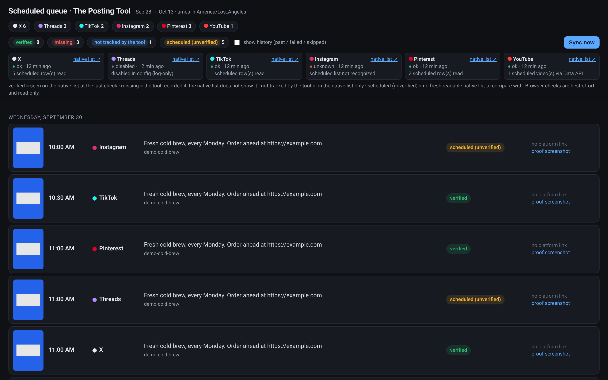

# The Posting Tool

**Free, open-source social scheduling for short-form video.** MIT licensed.
No accounts, no subscriptions, no hosted service — it runs on your machine
against your own logged-in accounts.

The Posting Tool is two things:

1. **A playbook for a cloud-model / computer-use agent** ([`docs/PLAYBOOK.md`](docs/PLAYBOOK.md))
   that drives the Chrome window you already have open and signed in, and
   schedules each video with the platform's **native Schedule** feature.
2. **An optional Python backup** (`schedule_batch.py` + Playwright) for when
   your agent usage is exhausted. Same safety gates, but expect to adapt
   selectors when platform UIs change.

Need clips to post? Pair it with
[**Open Source Clipper**](https://github.com/okwithit9-debug/open-source-clipper).

## What it does

| Platform  | Primary (agent) | Backup (Python) | Proof |
|-----------|-----------------|-----------------|-------|
| X         | native Schedule | Playwright      | scheduled list |
| Threads   | native Schedule | Playwright      | scheduled list |
| TikTok    | native Schedule (≤10 days) | Playwright | scheduled list |
| Instagram | native Schedule | Playwright / Meta Business Suite | scheduled list |
| Pinterest | native Schedule (≤14 days) | Playwright | scheduled list |
| YouTube   | native Schedule | YouTube Data API (`publishAt`) | Studio list |
| Reddit    | —               | Reddit API (PRAW), paused by default | — |

Safety rules baked in (`platforms/_safety_locks.py`, `platforms/_preflight.py`):

- **Never "Post now."** If a scheduler is missing, it pauses — that's a
  wall, not a tool bug.
- **Handle-check** on the live tab before every schedule.
- **Proof = the native scheduled list**, not a toast.
- **One CTA URL** (`YOUR_CTA_HOST`) per caption.
- **No second Chrome** and no guessed Chrome profile — fails closed if not configured.

## Setup

Requirements: Python 3.11+, Google Chrome. The launcher scripts in
`scripts/macos/` and the LaunchAgent are macOS-only and optional.

```bash
git clone https://github.com/okwithit9-debug/the-posting-tool.git
cd the-posting-tool
python3 -m venv .venv && source .venv/bin/activate
pip install -r requirements.txt
python3 -m playwright install chromium

cp profile.example.json profile.json   # your handle, CTA host, Chrome profile, timezone
cp config.example.json  config.json    # API creds (YouTube, optional Reddit/Meta)
cp .env.example .env                   # optional env overrides (export them / source .env)
```

### Primary path (agent)

Point your computer-use agent at [`AGENTS.md`](AGENTS.md) and
[`docs/PLAYBOOK.md`](docs/PLAYBOOK.md). Gates are in
[`docs/SETUP_GATES.md`](docs/SETUP_GATES.md).

### Backup path (Python)

```bash
python3 setup_playwright_logins.py    # sign in once in the Playwright profile
python3 setup_youtube_auth.py         # one-time YouTube OAuth
python3 schedule_batch.py preflight   # gates must pass
python3 schedule_batch.py dispatch
```

Drop videos plus sidecar JSON into `inbox/`. Full details:
[`INSTALL.md`](INSTALL.md).

## Dashboard (scheduled queue)

[`dashboard/`](dashboard/README.md) is a local, read-only page on
`127.0.0.1` that lists every post the tool has scheduled on X, Threads,
TikTok, Instagram, Pinterest and YouTube. Each row shows the time, a
caption preview, a thumbnail, the proof screenshot and a status (verified /
missing / not tracked / unverified). **Sync now** reads the native
scheduled lists from a Chrome you already opened (attach-only over CDP).
It never clicks Schedule, Post or Delete.

```bash
cd dashboard
python3 -m posting_dashboard backfill   # import posted/ + failed/ receipts
python3 -m posting_dashboard serve      # http://127.0.0.1:8765
```

After each native-list PASS, run the **Record it** step in
[`docs/PLAYBOOK.md`](docs/PLAYBOOK.md#record-it-after-every-pass).



## Tests

```bash
python3 -m unittest tests.test_safety_locks -v
(cd dashboard && python3 -m unittest discover -s tests -t .)
```

## Notes

- Deliberately **not included**: any tool that copies cookies out of your
  daily browser profile. Sign in once inside the Playwright profile instead.
- Platform UIs change constantly. Selector fixes are welcome — see
  [`CONTRIBUTING.md`](CONTRIBUTING.md).
- You are responsible for following each platform's terms of service.

## License

[MIT](LICENSE)
